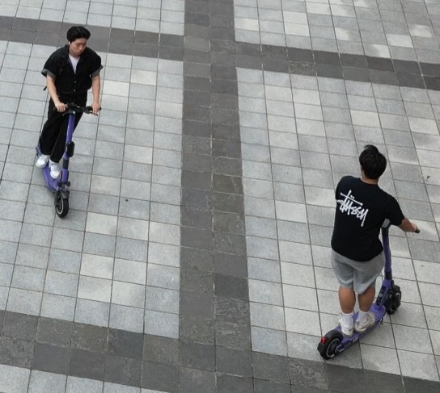
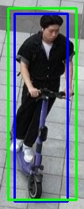
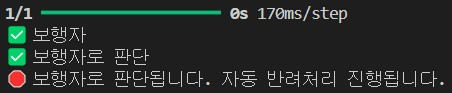
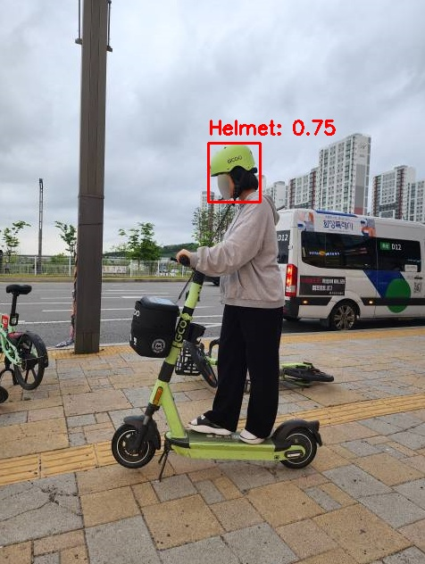

# 🧠 KTS_AI_Analysis - 전동킥보드 안전 규제 위반 자동 분석 파이프라인

`YOLOv11`, `MediaPipe-LSTM`, `Firebase`, `VWorld API` 등 다양한 기술을 결합하여  
**전동킥보드 위반 신고 이미지를 자동으로 분석하고 결론을 도출하는 AI 기반 통합 파이프라인**입니다.

본 프로젝트는 전체 시스템의 중앙 분석 엔진으로 작동하며,  
실시간으로 Firestore를 모니터링하여 새로운 신고가 접수되면 자동으로 처리 절차를 수행합니다.

<p align="center">
  
  
  
  
  
  
</p>

---

## 📌 주요 기능 요약

- **Firestore 실시간 감지**  
  신고 데이터(`imageUrl`, `violation` 등)가 추가되면 즉시 분석 시작

- **객체 감지 및 전처리**  
  YOLOv11을 통해 사진 속 전동킥보드, 사람 객체를 탐지하고 그룹화

- **AI 자동 반려 처리**
  - 사람이 없거나 킥보드가 없을 경우 → `"감지 실패"`로 자동 반려
  - 사진 내 인물 모두가 보행자로 판단되면 → `"보행자"`로 자동 반려

- **LSTM 포즈 분석**  
  MediaPipe로 관절 추출 후, LSTM 모델로 사람의 행동을 분석해 탑승 여부 판단

- **탑승 위반 판단 로직**
  - 탑승자 2명 이상 → `"2인탑승 의심"`
  - 탑승자 1명 → `정상`
  - 탑승자 0명 + 보행자 ≥ 1명 → `"보행자로 판단"`

- **브랜드 및 헬멧 분석**
  - 킥보드 브랜드 인식 (불가 시 자동 반려)
    - 관리자가 탑승자 개인 정보를 요청할 회사 정보를 알아내는데 사용
  - 헬멧 감지 (미착용 시 `"헬멧 미착용"`으로 저장)

- **주소 정보 변환**
  - GPS 좌표를 바탕으로 VWorld API를 통해 지번 주소 추출

- **결과 저장**
  - 분석 결과는 Firebase `Conclusion` 컬렉션에 저장됨
  - 감지 이미지도 Firebase Storage에 업로드됨

---

## 🧩 파이프라인 구조

```bash
[Firestore (Report)] → 실시간 감지
↓
[이미지 다운로드]
↓
[YOLOv11 객체 탐지: 킥보드 / 사람]
↓
[탑승자-킥보드 그룹핑 및 Crop]
↓
[MediaPipe → LSTM 분석]
↓
[위반 판단 로직 (2인탑승 / 보행자)]
↓
[브랜드 분석 + 헬멧 감지]
↓
[VWorld API → 지번 주소 추출]
↓
[Firebase Firestore + Storage 저장]
```

---

## 🗂 주요 파일 구성

| 파일명 | 설명 |
|--------|------|
| `AI_Analysis_new.py` | Firestore 실시간 감지 및 전체 AI 파이프라인 실행 메인 |
| `YOLOv11/YOLO.py` | 객체 감지 (킥보드, 사람, 브랜드, 헬멧) |
| `MediaPipe/lstm_Analysis.py` | 이미지에서 사람 포즈 분석하여 탑승 여부 판단 |
| `YOLOv11/geocoding.py` | GPS 좌표 → 지번주소 변환 |
| `firebase_config.py` | Firebase 인증 설정 |

---

## 🚀 실행 방법

### 1. 의존성 설치

```bash
pip install -r requirements.txt
```

### 2.환경변수 설정 (.env 파일 생성)
```bash
VWorld_API=여기에_발급받은_API_키
```

### 3. 실행
```bash
python AI_Analysis_new.py
```
→ `Firestore`의 `Report` 컬렉션에 새로운 신고가 들어오면 자동으로 분석됩니다.

---

## 📸 분석 예시 이미지

> 신고 이미지를 기반으로 분석된 실제 결과 예시입니다.  
> YOLO 기반 탐지, 그룹화, LSTM 판별, 헬멧 분석까지 순차적으로 진행됩니다.

### 🧍‍♂️ 원본 탐지 + 그룹화 결과

| 원본 이미지 | 그룹화된 탑승자 1 | 그룹화된 탑승자 2 |
|-------------|-------------------|-------------------|
|  |  |  |

- ✅ YOLOv11로 여러 객체(킥보드, 사람 등) 감지
- ✅ 객체 간 거리 기반으로 킥보드+사람 자동 그룹화
- ✅ 각 그룹을 따로 분석하여 판단

### 🧠 포즈 분석 결과 (MediaPipe + LSTM)

| 관절 추출 (MediaPipe) | 행동 분석 결과 (LSTM) |
|------------------------|------------------------|
|  |  |

- 🧩 관절 33개 추출 후 좌표를 시퀀스로 변환
- 🧠 LSTM 학습 모델을 통해 탑승 / 보행 행동 분류
- ✅ 결과는 `aiConclusion`에 자동 저장

### 🪖 헬멧 박싱 결과

<p align="left">
  
</p>

- ✅ 헬멧 착용 여부 분석
- ✅ 착용 시 헬멧 위치를 자동으로 박싱 표시
- ❌ 미착용 시 `aiConclusion`에 `"헬멧 미착용"` 자동 기록


---

## 🔍 예외 처리 및 자동 반려 조건

- 감지 실패: 사람 or 킥보드 둘 중 하나라도 없음 → 자동 반려
- 보행자: 탑승자가 한 명도 없고, 보행자만 존재 → 자동 반려
- 브랜드 인식 실패 → 자동 반려
- 분석 중 예외 발생 → `"분석불가"`로 기록됨

---

## 📦 연계 모듈

| 모듈명 | 설명 |
|--------|------|
| `KTS_YOLO` | 기반 YOLO 감지 시스템 & CCTV를 통한 자동 단속 및 신고 시스템 |
| `KTS_MediaPipe-LSTM`	| LSTM 포즈 분석 기반 탑승자 판단 시스템 |

---

## 💡 향후 개선 아이디어
- ✅ 2인 이상 탑승 분석 시, 킥보드 이외 객체 구분 고도화

---

## 📬 Contact

- **개발자**: 박창률  
- **GitHub**: [ParkerQH](https://github.com/ParkerQH)
  
